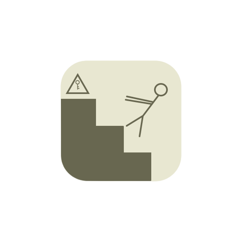
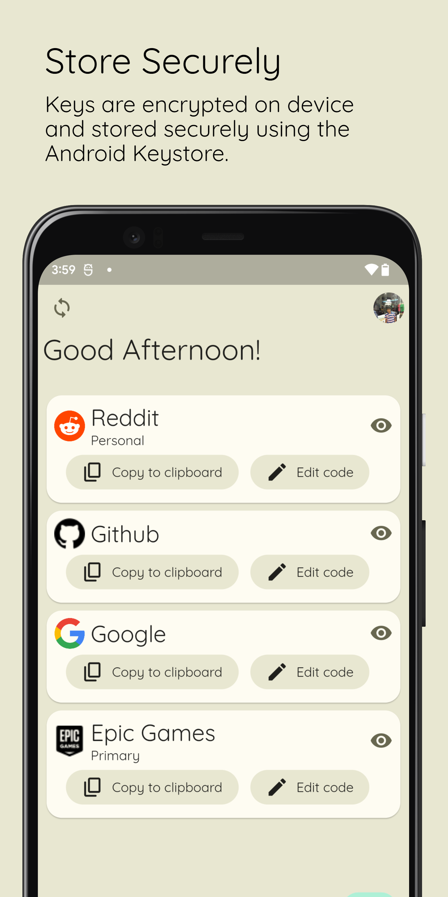
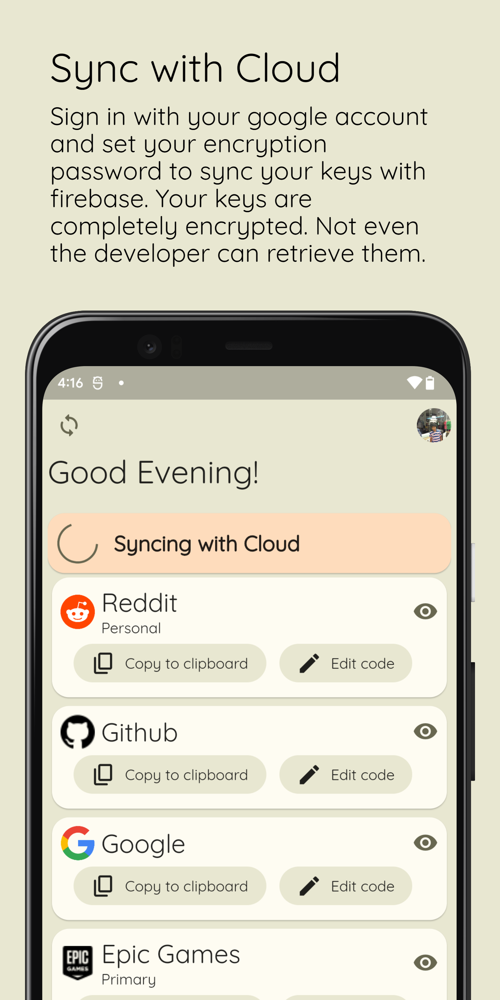
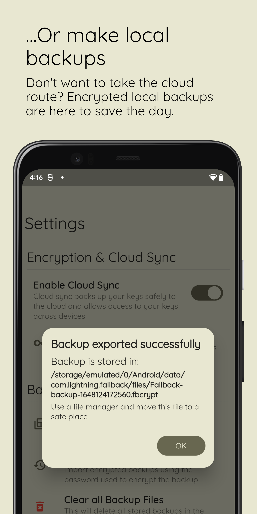

    
    <h1>Fallback</h1>

    <h2>About</h2>
    
An application you "Fallback" to when you don't have access to your 2FA codes. Fallback is built using Flutter and follows Material Design 3. The Android app is now available on Google Play Store.

    <h2>What does it do?</h2>
    
Fallback lets you store and retrieve your backup keys. Stored keys are always encrypted and the user must use a biometric method to be able to view the keys

    <h2>Features</h2>
    <ul>
        <li>Cloud Sync: Keys can be synced to the project's firestore and can be retrieved by the user anytime (even across devices)</li>
        <li>Local Backups: Users who don't want to or can't use Cloud Sync can also make backups and restore their keys.</li>
        <li>Fully Encrypted: Keys are fully encrypted at all times. Keys are encrypted using the password that the user sets which is then synced to the cloud or stored as a local backup. Users cannot use cloud sync or make local backups without setting their encryption password.</li>
    </ul>

    
    
    

